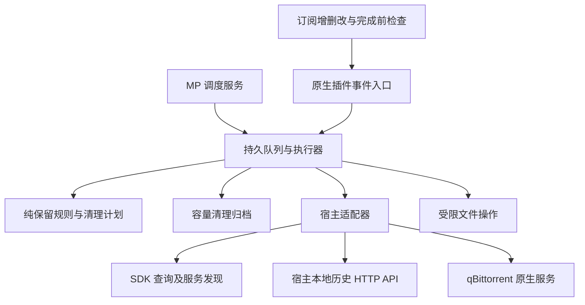

# 架构与维护接口

## 模块边界

| 文件 | 职责 |
| --- | --- |
| `__init__.py` | 宿主生命周期、事件、表单、状态页、调度服务 |
| `models.py` | 媒体身份、订阅范围、任务文件、计划及序列化 |
| `planner.py` | 从当前快照建立可审查计划；保护共享文件、范围并集、硬链接 |
| `filesystem.py` | 根目录边界、路径验证、文件指纹、受限 unlink、空目录清理 |
| `archive.py` | 已观察媒体消失的归档及资源拦截规则 |
| `controller.py` | 取消队列、挂载基线、持久执行日志、重试、逐步订阅校验 |
| `host.py` | 唯一宿主版本边界；SDK、下载器与公开历史 API |

没有独立常驻进程、1Panel cron、宿主数据库 SQL、私有配置拷贝或 monkey patch。宿主服务发现负责连接和路径映射。历史删除通过经认证的 localhost HTTP API，凭据仅运行时读取，不写入日志/插件数据。

状态修改使用进程共享线程锁及插件数据目录中的文件锁，避免热重载实例、事件回调和巡检相互覆盖取消/归档记录。运行入口另有非阻塞执行锁，重复调度直接跳过，保留下一轮正常巡检。

## v3.0.4 接口基线

已对照 [MoviePilot v3.0.4](https://github.com/jxxghp/MoviePilot/tree/v3.0.4)，提交 `e195cc164fc8ff869ffee0ea44a49c7ec475310c`。

| 接口 | 用途与升级检查 |
| --- | --- |
| `app.sdk.plugin._PluginBase` | 生命周期、配置、插件数据、服务、表单和页面 |
| `app.sdk.events.eventmanager` | 写回原始完成检查与资源拦截 payload；只读 snapshot 不用于输出 |
| `SubscribeCompletionCheck` | `subscribe` 输入，`cancel/source/reason` 输出；必须早于自动完成事务 |
| `SubscribeDeleted` | `subscribe_info` 删除前快照；宿主持久事件重投 |
| `SubscribeAdded/SubscribeModified/TransferComplete` | 提前同步；新增订阅解除旧归档 |
| `ResourceSelection` | 优先继承此前插件的 `updated_contexts`，输出 `updated/updated_contexts/source` |
| `ResourceDownload` | 只处理 `Subscribe` 来源，尊重既有取消，输出 `cancel/source/reason` |
| `app.sdk.queries` | 200 条分页，`items/has_next`；只读订阅、下载及整理快照 |
| `app.sdk.media.resolve_media_identity/MetaInfo` | 规范媒体身份和文件级集数，季号缺省不能视为显式证据 |
| `DownloaderHelper.get_service` | 宿主 qB 服务实例、模块、类型及宿主路径映射 |
| `chain.list_torrents/torrent_files/stop_torrents/start_torrents/remove_torrents` | 验证文件清单，暂停并核验状态，删除并核验不存在 |
| qB 服务 `get_torrents/set_files` | 失败不能视为零任务，混合包文件优先级设 0 后核验每个文件 |
| `DELETE /api/v1/history/transfer` | `json: {id}`，`deletesrc=false&deletedest=false`，API 成功后 SDK 核验不存在 |
| `DELETE /api/v1/history/download` | `json: {id}`，API 成功后 SDK 核验不存在 |
| `MediaServerHelper.get_services` | 调用各实例 `refresh_root_library`，失败保持刷新待办 |
| `app.sdk.scheduler.start_scheduler_job` | 使用 `SubscriptionLibrary_reconcile` 提前运行，间隔服务提供兜底 |

不使用较新 v3 分支才出现的 `add_plugin_once_job`，保持当前版本兼容。v3.0.4 宿主源码需要其自身 Python 运行时；本仓库测试不完整导入宿主。

## 执行顺序

1. 读取完整当前订阅、下载和整理快照；下载器不可用时拒绝删除计划。
2. 检查媒体根目录基线，记录已整理目标，识别先前存在、现在消失的仍订阅集数。
3. 将取消意图与当前订阅范围合并；同一媒体任何保留范围都能保护内容。
4. 演练保存预览。正式执行保存原始任务运行状态和整份计划后暂停受影响任务。
5. 每项操作前核对启用/演练开关、挂载和订阅指纹；文件删除前核对 inode、大小和修改时间。
6. 混合包设置冗余文件优先级 0；全部不需要且没有共享保护的包删除任务及其源文件。
7. 删除已校验的本地文件、同名配套文件和授权目录内硬链接，清理空目录。
8. 清理已确认删除的历史记录。恢复保留任务原始运行状态，刷新媒体服务器。

状态 schema 1 包含取消队列、已观察的订阅身份、归档、目标文件观察、根目录身份、执行计划、原始运行状态及刷新待办。失败原样保留计划；订阅指纹改变时丢弃旧计划并重新计算。订阅快照补偿只针对先前已观察的身份，不将订阅列表为空理解为可以清空整个硬盘。

## 增加下载器或规则

新下载器适配器必须提供：有明确失败信号的任务查询、映射到 MP 的文件清单、暂停确认、删除确认以及混合包逐文件跳过能力。无法支持选择性文件下载时，保留混合包，不能以删除整包代替。

新保留规则先加入独立模型/Planner，覆盖共享文件与范围变化测试，再在宿主适配器增加所需输入。不要在事件回调中直接删文件，也不要用标题匹配代替稳定媒体身份。

若以后容量插件提供正式删除事件，可增加该事件适配器，使归档更及时；当前以持久观察与下载前核验兼容无需改动的容量插件。

## 测试与生产验收

自动测试覆盖规则和宿主边界替身；临时文件验证文件系统操作。生产验收单独检查：插件能装载、完成订阅被保留、演练正确、可丢弃单集取消确实移除任务/源/库、混合包保留新集、容量删除后旧集被拦截而新集可下载、重启归档仍在。

宿主升级后先演练并核对上表；接口变化集中修改 `host.py` 和事件入口。默认停用+演练不等于已完成生产验收。
